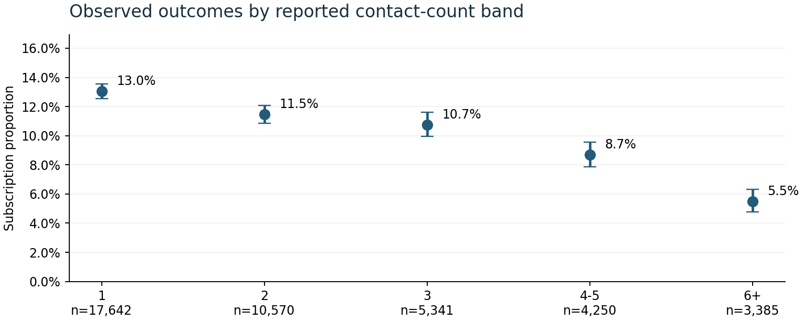
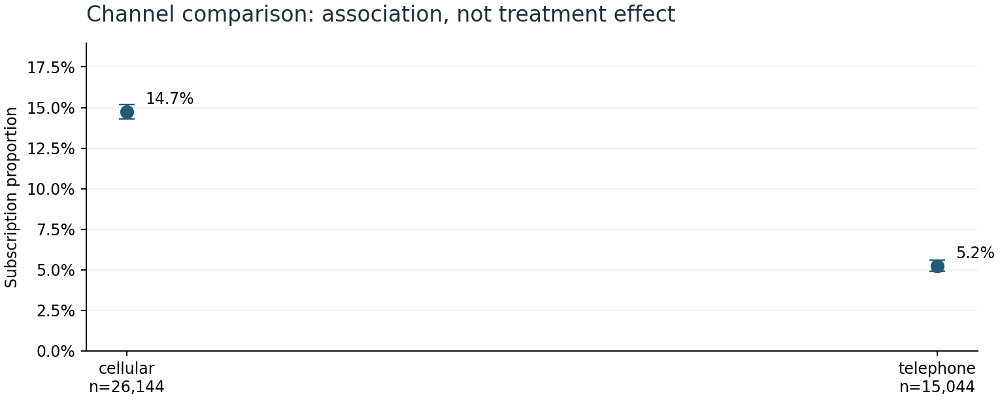
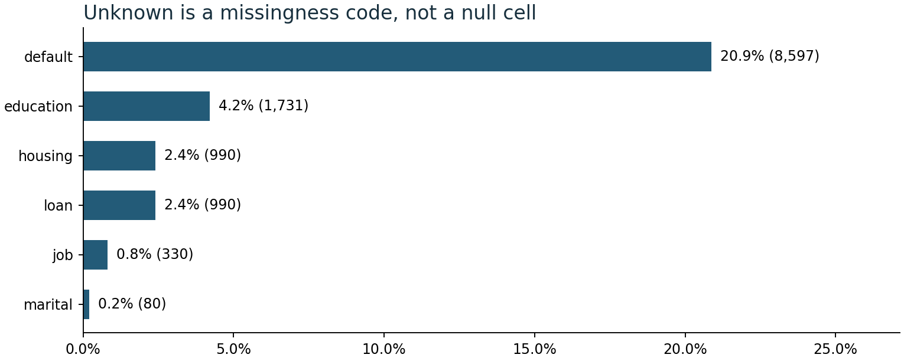

# Bank campaign operations

An independent student portfolio project using the UCI Bank Marketing dataset to examine reported contact pressure, channel mix, and subscription outcomes for operational decision-making.

## Business question

What can historical campaign records show about repeat-contact patterns, and what evidence is still needed before changing contact rules or proposing a contact cap?

The analysis is designed for a practical analyst handoff: it makes the record grain explicit, preserves data-quality signals, compares observed groups, and separates evidence from decisions that require a controlled pilot.

## Dataset and verified controls

The source is `bank-additional-full.csv`, containing 41,188 records, 20 input fields, and the outcome `y`. There are 4,640 subscriptions, an observed record-level proportion of 11.265%. The source covers May 2008–November 2010, but does not provide a unique customer ID, exact date, or year.

The published unit is therefore a campaign record, not a verified customer or call. `campaign` reports contacts in the current campaign and includes the last contact. For analysis it is grouped into `1`, `2`, `3`, `4-5`, and `6+`; summed reported contacts are not a verified count of distinct calls.

Quality controls retain 12 excess identical rows across 12 duplicate groups, affecting 24 records, because no business key proves they are ingestion errors. The source dictionary defines `pdays=999` as no previous contact, while 4,110 records also have `previous > 0`; this contradiction is flagged rather than silently repaired. Explicit `unknown` values remain visible in the missingness outputs.

## Evidence workflow

Python validates the schema and numeric/category domains, writes a SQLite ledger, and runs six grouped queries for contact pressure, channel, channel by month, prior outcome, pooled month, and pressure strata. Each aggregate includes records, subscriptions, observed subscription proportion, reported contacts, and a Wilson 95% interval. The renderer creates the three charts and a three-page PDF from those reconciled outputs.

### Observed contact pressure



### Channel comparison



### Data-quality signals



## Reports and notebook

- [Campaign operations brief](reports/campaign-operations-brief.pdf)
- [Executed analysis notebook](notebooks/campaign_operations.ipynb)
- [Validation manifest](reports/validation.json)
- [Contact-pressure aggregates](reports/contact_pressure.csv)
- [Channel aggregates](reports/channel.csv)
- [Pressure strata](reports/pressure_strata.csv)
- [Unknown-value audit](reports/unknowns.csv)

## Setup and reproduction

```bash
python -m venv .venv
# Windows PowerShell:
.\.venv\Scripts\Activate.ps1
# macOS/Linux:
# source .venv/bin/activate

pip install -r requirements.txt
python -m ipykernel install --sys-prefix --name python3
python build.py
python -m unittest discover tests
python render_report.py
python build_notebook.py
```

The notebook is generated and executed by `build_notebook.py`. The current validated run completed eight code cells without errors; the test suite completed six tests. The PDF was regenerated with three figures and its rendered pages were visually reviewed without clipping.

## Interpretation limits

This is descriptive, observational evidence. Wilson intervals assume independent records, but repeated people cannot be identified. Channel and contact pressure are confounded by selection and stopping behavior; successful subscriptions may stop further contacts. The results do not estimate causal uplift, a contact cap, ROI, revenue, or staffing savings. Calendar-month tables pool matching month labels across years and are not a chronological time series. `duration` is known after a contact and is excluded from prospective targeting.

The appropriate next step is a controlled measurement design with stable customer and campaign identifiers, contact timestamps, actual costs, and a defined follow-up window. This project does not claim that such a pilot has been run.

## Source and citation

[UCI Bank Marketing](https://archive.ics.uci.edu/dataset/222/bank+marketing), DOI `10.24432/C5K306`, licensed CC BY 4.0.

Moro, S., Cortez, P., & Rita, P. (2014). “A Data-Driven Approach to Predict the Success of Bank Telemarketing.” *Decision Support Systems*. DOI: `10.1016/j.dss.2014.03.001`. Repository: [nkpendyam/bank_campaign_operations](https://github.com/nkpendyam/bank_campaign_operations).
